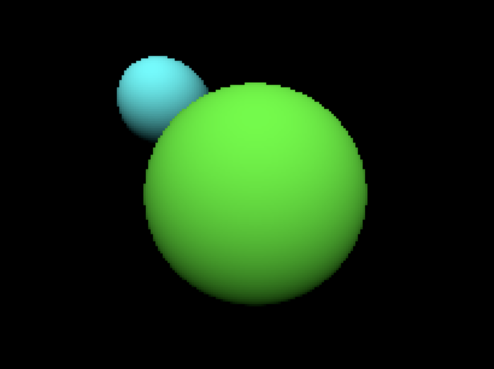

## Ray tracer

Small ray-tracer project adapted from [this post](https://matklad.github.io/2022/12/31/raytracer-construction-kit.html).

SDL2 instructions followed from [here](https://blog.logrocket.com/using-sdl2-bindings-rust/).



## Setup

Install `sdl2`:

```sh
brew install sdl2
```

On macOS with Apple silicon, need to add the following to your profile (`.zprofile`):

```sh
export LIBRARY_PATH="$LIBRARY_PATH:/opt/homebrew/lib"
```

[Source](https://github.com/PistonDevelopers/rust-empty/issues/175#issuecomment-927172098)
